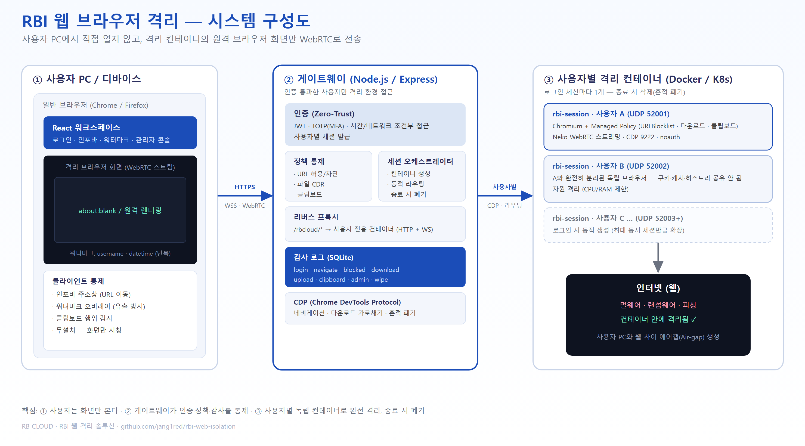
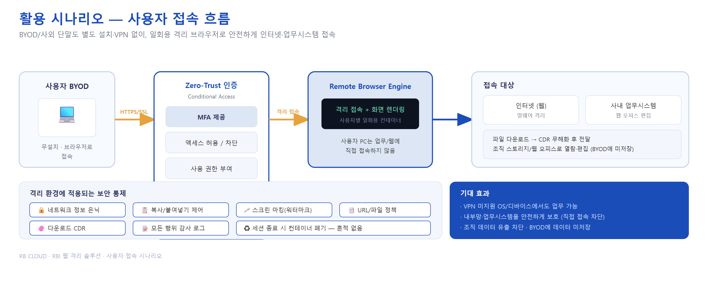

# RBI Web Isolation (RBCloud 기반 원격 브라우저 격리)

첨부된 **Spector(RBI) 제품 소개서**의 핵심 개념을 **RBCloud Browser** 격리 컨테이너 위에 구현한
**원격 브라우저 격리(Remote Browser Isolation)** MVP입니다.

> "Remote Browser 구성 및 원격 화면 스트리밍 전송" — 격리된 컨테이너에서 브라우저를 실행하고,
> 사용자에게는 **화면(WebRTC)만** 전달합니다. 웹의 모든 직접 접근을 차단해 멀웨어·랜섬웨어·피싱을 격리합니다.

## 전체 시스템 구성도



## 활용 시나리오



> 📊 **세션 라이프사이클 · 모듈 아키텍처 · 정책 이중방어 · 망분리 배치도** 등 전체 다이어그램은 [`docs/ARCHITECTURE.md`](docs/ARCHITECTURE.md)에서 확인하세요.

## 자료(Spector)와의 기능 매핑

| Spector 기능 (소개서) | 본 MVP 구현 위치 |
|---|---|
| 격리 브라우저 (컨테이너, 흔적 폐기) | **RBCloud Browser** 컨테이너 (`rbcloud-browser/`) |
| 원격 화면 스트리밍 (WebRTC) | RBCloud Browser WebRTC (iframe 임베드) |
| 인포바(전용 주소창) | `frontend/src/components/Infobar.jsx` + CDP 네비게이션 |
| 워터마크(내부 유출 방지) | `frontend/src/components/Watermark.jsx` |
| 계정/인증, MFA, Zero-Trust 조건부 접근 | `gateway/src/auth.js` (JWT+TOTP), `policy.js` (조건부) |
| URL 허용/차단·유해사이트 카테고리·로그 | `gateway/src/policy.js` + Chromium Managed Policy |
| 파일 업로드/다운로드 통제 + CDR | `gateway/src/cdr.js`, `DownloadRestrictions` 정책 |
| 클립보드 통제 (PC↔격리) | `gateway/src/policy.js` clipboard 정책 + CDP |
| 관리자 정책/통계/감사로그 | `gateway/src/routes/admin.routes.js`, `frontend Admin` |
| 온프레미스 & K8s 이식 | `docker-compose.yml`, `k8s/` |

> 본 저장소는 Spector의 **아키텍처 개념을 학습용으로 재구현**한 것이며 ERmind의 상용 제품과 무관합니다.
> CDR의 실제 무해화 엔진, AI 피싱 탐지 등 일부 고급 기능은 **연동 지점(hook)**만 제공합니다 — `docs/FEATURES.md` 참고.

## 빠른 시작 (Docker Compose)

```bash
cp .env.example .env          # 비밀키 등 환경변수 수정
docker compose up --build
# 브라우저에서 http://localhost:8080 접속
# 기본 관리자 계정: admin / changeme  (최초 로그인 후 변경 필수)
```

## 서버 배포 (Linux 서버 + 원격 접속)

서버를 별도 Linux 머신에 두고 다른 PC에서 접속하려면 **자동 배포 스크립트**를 사용하세요:

```bash
git clone https://github.com/jang1red/rbi-web-isolation
cd rbi-web-isolation
chmod +x deploy.sh
./deploy.sh              # 내부망: 서버 IP 자동 감지
./deploy.sh <공인IP>    # 외부망: 접속 IP 지정
```

자세한 내용은 **[DEPLOY.md](DEPLOY.md)** 참고. (Docker 설치 · 네트워크별 설정 · 포트 개방 · 문제 해결)

## 로컬 개발 (Docker 없이 일부)

```bash
# 1) 게이트웨이
cd gateway && npm install && npm run dev
# 2) 프론트엔드
cd frontend && npm install && npm run dev
```
(격리 브라우저 화면은 RBCloud Browser 컨테이너가 필요하므로 Compose 사용을 권장합니다.)

## 디렉터리

```
rbi-web-isolation/
├─ docker-compose.yml          # 전체 스택 (rbcloud-browser + gateway)
├─ .env.example
├─ gateway/                    # Node.js 백엔드: 인증·정책·감사·프록시·관리 API
├─ frontend/                   # React 워크스페이스 (인포바/워터마크) + 관리자 콘솔
├─ rbcloud-browser/            # RBCloud Browser 이미지 (원격 디버깅 + 관리정책 마운트)
├─ k8s/                        # 쿠버네티스 확장 매니페스트
└─ docs/                       # 아키텍처·기능 매핑·운영 문서
```

자세한 내용은 [`docs/ARCHITECTURE.md`](docs/ARCHITECTURE.md), [`docs/FEATURES.md`](docs/FEATURES.md) 참고.
