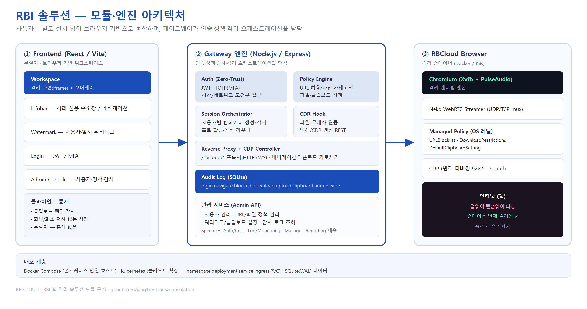
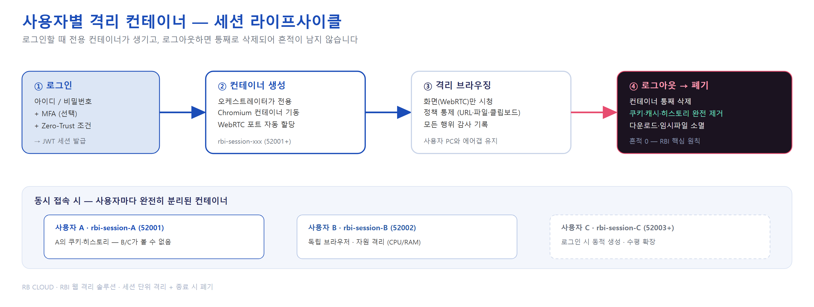
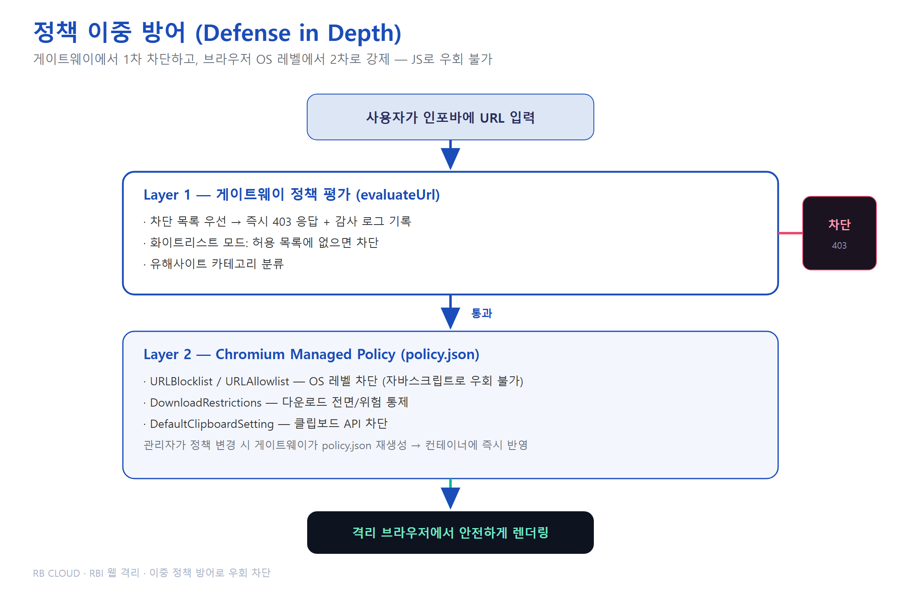
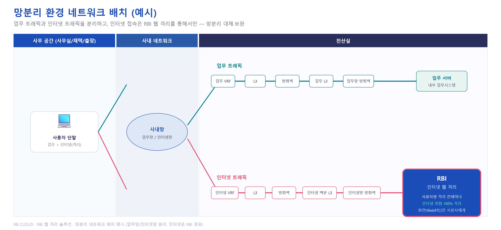
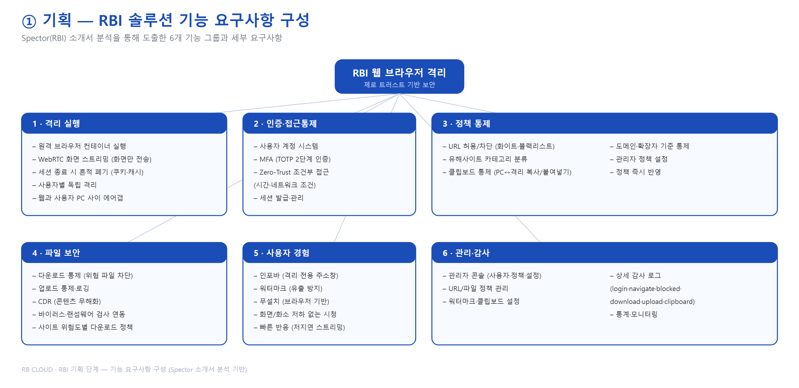
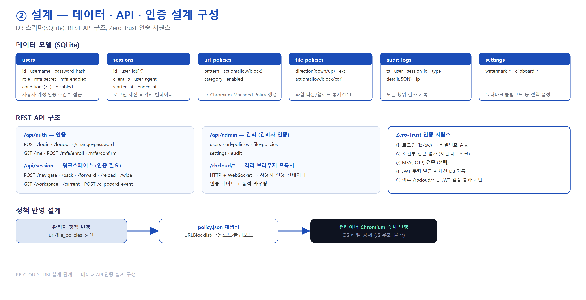
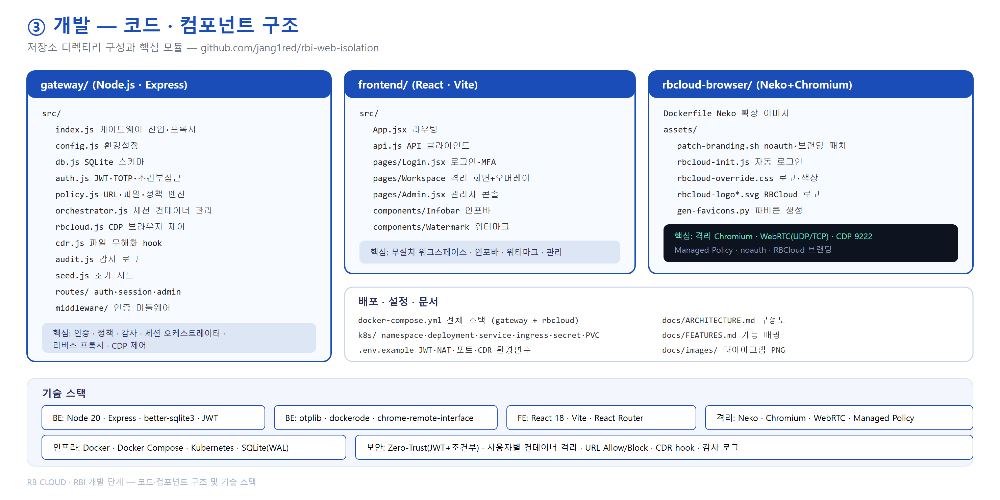

# 시스템 아키텍처

> 아래 다이어그램은 `docs/images/`에 PNG로 제공됩니다. (Spector RBI 소개서 스타일의 시각 자료)

## 📊 다이어그램 모음

### 1) 전체 시스템 구성도


### 2) 모듈·엔진 아키텍처


### 3) 사용자별 격리 컨테이너 — 세션 라이프사이클


### 4) 정책 이중 방어 (Defense in Depth)


### 5) 활용 시나리오 — 사용자 접속 흐름


### 6) 망분리 환경 네트워크 배치


## 📋 단계별 구성도 (기획 · 설계 · 개발)

### 기획 — 기능 요구사항 구성 (6개 기능 그룹)


### 설계 — 데이터(DB)·API·인증 시퀀스 설계


### 개발 — 코드·컴포넌트 구조 + 기술 스택


---

## 전체 구성도 (텍스트)

```
┌──────────────────────────────────────────────────────────────────────────────────┐
│                              사용자 PC / 디바이스                                 │
│                                                                                    │
│  ┌──────────────────────────────────────────────────────────────────────────────┐ │
│  │                       브라우저 (일반 Chrome / Firefox)                         │ │
│  │                                                                                │ │
│  │  ┌──────────────┐   ┌──────────────────────────────────────────────────────┐  │ │
│  │  │  React SPA    │   │              격리 워크스페이스 화면                     │  │ │
│  │  │  (로그인/관리) │   │                                                        │  │ │
│  │  │  인포바        │   │   [RBCloud WebRTC 스트림 iframe — 격리 브라우저 화면]      │  │ │
│  │  │  워터마크 오버레이│  │   [워터마크: username · datetime 반복 텍스트]           │  │ │
│  │  └──────┬───────┘   └──────────────────────────┬───────────────────────────┘  │ │
│  └─────────┼──────────────────────────────────────┼──────────────────────────────┘ │
└────────────┼──────────────────────────────────────┼────────────────────────────────┘
             │ HTTPS + Cookie(JWT)                    │ WebRTC (미디어 스트림)
             ▼                                        ▼
┌────────────────────────────────────────────────────────────────────────────────────┐
│                         게이트웨이 (Node.js / Express)                              │
│                                                                                      │
│  ┌─────────────┐  ┌──────────────┐  ┌────────────────┐  ┌─────────────────────┐   │
│  │  Auth        │  │  Policy      │  │  CDR Hook       │  │  Reverse Proxy      │   │
│  │  JWT + TOTP  │  │  URL / File  │  │  파일 무해화     │  │  /rbcloud/* → RBCloud Browser     │   │
│  │  ZT Condition│  │  Clipboard   │  │  외부 엔진 연동  │  │  WebSocket upgrade  │   │
│  └─────────────┘  └──────────────┘  └────────────────┘  └─────────────────────┘   │
│                                                                                      │
│  ┌──────────────────────────────────────────────────────────────────────────────┐   │
│  │  감사 로그 (SQLite audit_logs)                                                 │   │
│  │  login / navigate / blocked / download / upload / clipboard / admin / wipe   │   │
│  └──────────────────────────────────────────────────────────────────────────────┘   │
└──────────────────────────────────────┬──────────┬──────────────────────────────────┘
          API (인증/정책/감사)           │          │ CDP (Chrome DevTools Protocol)
          /api/auth /api/session        │          │ 네비게이션·다운로드 제어
          /api/admin                   │          │
                                       ▼          ▼
                         ┌────────────────────────────────────────┐
                         │      RBCloud Browser 컨테이너 (Docker/K8s Pod)      │
                         │                                          │
                         │  ┌──────────────────────────────────┐   │
                         │  │  Chromium 브라우저 (Xvfb + PulseAudio)│  │
                         │  │  - Managed Policy 적용:            │   │
                         │  │    URLAllowlist / URLBlocklist     │   │
                         │  │    DownloadRestrictions            │   │
                         │  │    DefaultClipboardSetting         │   │
                         │  │  - 원격 디버깅 포트 9222            │   │
                         │  └────────────────┬─────────────────┘   │
                         │                   │ 인터넷               │
                         │                   ▼                      │
                         │          ┌─────────────────┐             │
                         │          │    인터넷 (웹)    │             │
                         │          │  멀웨어·피싱·     │             │
                         │          │  랜섬웨어 격리됨  │             │
                         │          └─────────────────┘             │
                         └────────────────────────────────────────┘
```

## 정책 시행 이중 방어 (Defense in Depth)

```
사용자 입력 URL
       │
       ▼
┌──────────────────────────────────────────────────────────┐
│  Layer 1: 게이트웨이 정책 평가 (evaluateUrl)               │
│  - 차단 목록 우선 → 즉시 403 + 감사 로그                   │
│  - 화이트리스트 모드: 허용 항목 없으면 차단                  │
└──────────────────────┬───────────────────────────────────┘
                       │ 통과
                       ▼
┌──────────────────────────────────────────────────────────┐
│  Layer 2: Chromium Managed Policy (policy.json)           │
│  - URLBlocklist: OS 레벨 차단 (JS 우회 불가)               │
│  - URLAllowlist: 화이트리스트                              │
│  - DownloadRestrictions: 다운로드 전면 통제                 │
│  - DefaultClipboardSetting: 클립보드 API 차단              │
└──────────────────────────────────────────────────────────┘
```

## 인증 흐름 (Zero-Trust)

```
사용자                 게이트웨이                 DB
  │                       │                      │
  │── POST /login ────────▶│                      │
  │   username + password  │── getUserByName ────▶│
  │                       │◀─ user row ───────────│
  │                       │── verifyPassword      │
  │                       │── evaluateConditions  │
  │                       │   (시간/네트워크 ZT 조건) │
  │                       │                      │
  │   [MFA enabled]       │                      │
  │── mfaToken ───────────▶│── verifyTotp         │
  │                       │                      │
  │◀── JWT Cookie ─────────│── INSERT session ───▶│
  │    rbi_session=...     │── audit('login') ───▶│
  │                       │                      │
  │── GET /rbcloud/* ─────────▶│                      │
  │   (Cookie)             │── gateRBCloud()         │
  │                       │   verifyToken        │
  │                       │   getUserById        │
  │◀── 격리 브라우저 프록시 ──│                      │
```

## Managed Policy 갱신 사이클

```
관리자                 게이트웨이            Chromium (RBCloud Browser)
  │                       │                     │
  │── POST /admin/url-policies ──▶│             │
  │                       │── SQLite INSERT      │
  │                       │── regenerateManagedPolicy()
  │                       │── write policy.json ─────────▶│ (공유 볼륨)
  │                       │                     │ 재로드 (Chromium 정책 polling)
```

## 컴포넌트 목록

| 컴포넌트 | 기술 | 역할 |
|---|---|---|
| `gateway/` | Node.js 20, Express | 인증·정책·감사·RBCloud Browser 프록시·관리 API |
| `frontend/` | React 18, Vite | 로그인·워크스페이스(인포바+워터마크)·관리자 콘솔 |
| `rbcloud-browser/` | RBCloud Browser + Chromium | 격리 브라우저, WebRTC 스트리밍 |
| `docker-compose.yml` | Docker Compose | 로컬/온프레미스 단일 호스트 배포 |
| `k8s/` | Kubernetes YAML | 클라우드/K8s 확장 배포 |
| `data/rbi.db` | SQLite (WAL) | 사용자·세션·정책·감사 로그 |
| `data/policies/policy.json` | Chromium Managed Policy | 격리 브라우저 강제 정책 |
